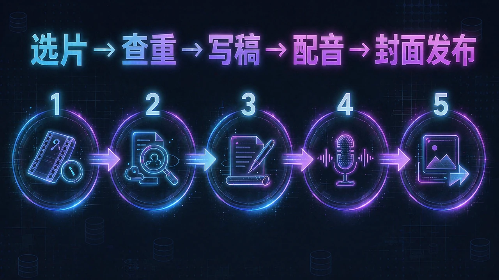

<!-- README-PROMO:START -->
<p align="center">
  
  
  
</p>
<!-- README-PROMO:END -->

# ALAN 艾伦 — 电影解说全流程 Agent Skill

B站/抖音电影解说 UP 主「艾伦」的全流程技能：**选片 → 已解说库查重 → 写口播稿 → 校验 → 配音 → 封面发布**。

<p align="center">
  
  
  
  
  
</p>

**频道定位**：**全网首发**冷门经典恐怖 / 铅黄（Giallo）/ 剥削（B 级）片，目标 200 部全网首发。

文风与选片标准全部从艾伦亲笔的 **63 篇解说稿**逐条提炼。

---

## 何时使用

| 说法 | 触发流程 |
|---|---|
| "帮我选片 / 推荐一部没解说过的恐怖片" | 选片流 |
| "写解说稿 / 按艾伦风格写一篇" | 写稿流 |
| "这部片艾伦解说过吗" | 查重 |
| "配音 / 合成语音 / 克隆音色读稿" | 配音流 |
| "生成封面 / 发布信息" | 封面发布流 |

---

## 一、选片标准

1. **题材范围**：意大利/西班牙铅黄 Giallo、70-80 年代 B 级恐怖、剥削片、Hammer 吸血鬼、slasher、冷门科幻恐怖；延伸经典恐怖/惊悚/夺宝探险/西部。
2. **硬性调性**：**女主颜值/身材必须在线**，裸露戏份是加分项。
3. **全网首发**：中文区没人完整解说过。选片必须 ① 跑 `scripts/check_done.py` 查已解说库 ② 豆瓣查是否有评分/是否已有 UP 主解说。
4. **质量底线**：IMDB 先筛演员（个人评分 5+）保证下限，再筛导演（导演评分 8+）保证上限。
5. **片源可得性**：能找到蓝光/修复版生肉。
6. **系列补拍机会**：已做续集的可以回头做第一部。

---

## 二、解说稿文风规范

### 结构模板（6 件套）

1. **开场钩子**：2-4 句名场面白描，短句堆叠悬念，**不能第一句就报片名**。钩子段角色一律匿名（用"女孩/小伙"指代）。
2. **影片信息段**："今天艾伦的全网首发/细读经典，带来 [年份]年上映的[国家][类型]《片名》……" —— 卡司只报【女主】+【男主】，配角一律不报名字。
3. **正片解说**：第三人称逐场景叙事，短句为主、一句一行，人物用外号。
4. **结尾句**："好了 电影结束"。
5. **点评段**：≤100 字，槽点半句 + 亮点半句 + 烂片指数或分数收尾。
6. **互动+签名**：互动 + 固定签名 **"我是艾伦 一个[当期梗]的阿婆 好了 我要去遛狗了 下期更精彩哦"**。

### 开场美女钩子规律（63 篇实测）

频道钩子 = **美色开路**。63 篇中开头两句内含美色招牌的约 32 篇（每 2 篇就有 1 篇）：

- **机制 A：场景美色钩** —— 梳妆/更衣/泳装型、身体慢镜+偷窥型、情色张力+险型。**铁律**：美色镜头最多 2-4 句，第 3-5 句必须"变"（危险逼近/悬念/意外）。
- **机制 B：信息段女色招牌** —— 第一句直接砸女色标签（女星头衔句式 / 阵容密度句式 / 擦边预告句式）。

### 语言特征

- 短句一行一句，口语感叹词：好家伙/哎呀/我的天/乖乖/噗呲/咔咔
- **叙述一律第三人称**，角色台词转述为间接引语
- **血腥黑话**：番茄酱/番茄汁 = 血；死亡动词一律隐晦（嗝屁/归西/没了/挂了/领盒饭…）；**"杀手"名词可用**
- **角色命名法**：男主 = 玛德，男二 = 法克，男三 = 谢特；女主 = 侯丽，女二 = 幂幂
- **裸露尺度词**：禁直白词，一律用"你们都懂的原因""能给的都给了""多豁得出去"

### 字数纪律

- 成稿目标 **3800–5200 字**（63 篇中位≈4300），硬界 2500–8000
- 开场钩子 **60–110 字**

---

## 三、自动工作流

### 选片流

```bash
python scripts/check_done.py "候选片名"          # 查重（支持中/英/别名模糊匹配）
python scripts/select_next.py <candidate.json>   # 批量过滤候选池
```

### 写稿流

```bash
python scripts/validate_script.py <稿.txt>   # 校验 6 件套 + 签名格式 + 黑话密度
```

### 配音流

```bash
python scripts/synthesize_alan_cpu.py   # GPT-SoVITS CPU 克隆艾伦音色，默认语速 1.0
```

质检门禁：格式/削波自动检查 + 开头 2–5 秒单独复听 + ASR 回听逐句核对。

### 封面 / 发布信息流

```bash
python scripts/select_cover_frame.py <源片> --times <秒,...>    # 抽候选帧并打分
python scripts/gen_jimeng_cover_prompts.py --movie <片名> --out <片目录>/封面/封面提示词-即梦.txt
python scripts/validate_publication_info.py <片目录>            # 标题≤25字 + 恰好5个话题词
```

封面标准 = 金发碧眼美女主体 + **仅一个大大的手写体电影名**（无其他文字），3:4 竖版 + 4:3 横版两段。

---

## 四、参考文件

| 文件 | 说明 |
|---|---|
| `scripts/done_movies.json` | 已解说 82 部电影索引（中/英名、年份、导演、女主） |
| `scripts/check_done.py` | 查重脚本 |
| `scripts/select_next.py` | 候选池过滤脚本 |
| `scripts/validate_script.py` | 稿子结构校验脚本 |
| `scripts/synthesize_alan_cpu.py` | GPT-SoVITS 克隆音色配音 |
| `scripts/select_cover_frame.py` | 封面选帧（抽帧 + 图像统计打分） |
| `scripts/gen_jimeng_cover_prompts.py` | 即梦图生图封面提示词生成 |
| `scripts/validate_publication_info.py` | 发布信息校验 |
| `references/voiceover-workflow.md` | 配音流完整契约 |
| `references/cover-publish.md` | 封面/发布信息流完整契约 |

完整规则见 [`SKILL.md`](SKILL.md)。

---

## 五、常见坑

- **中文老片 txt 混合编码**：解说稿大部分 GBK、少数 UTF-8+BOM，读取必须自动探测，直接按 UTF-8 读会乱码。
- 选片优先查**女主**（颜值身材是频道卖点），其次导演，其次冷门度。
- 生肉片源翻译量大，写稿前确认原片已到手，别对着 IMDB 简介编剧情。
- **暴力描写一律隐晦**：不写解剖细节，套路 = 拟声词 + 结果 + 番茄酱收尾。
- 评分制："烂片指数 10 分满分"时**分数越低越神**，别写反。

---

## License

MIT
